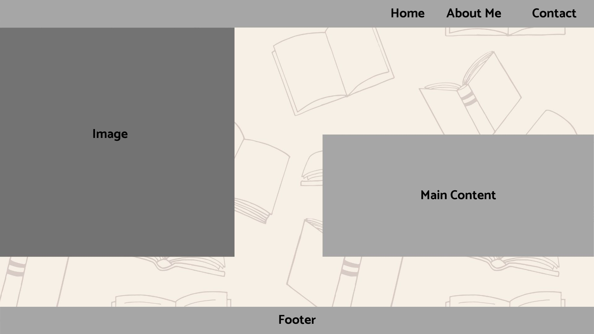
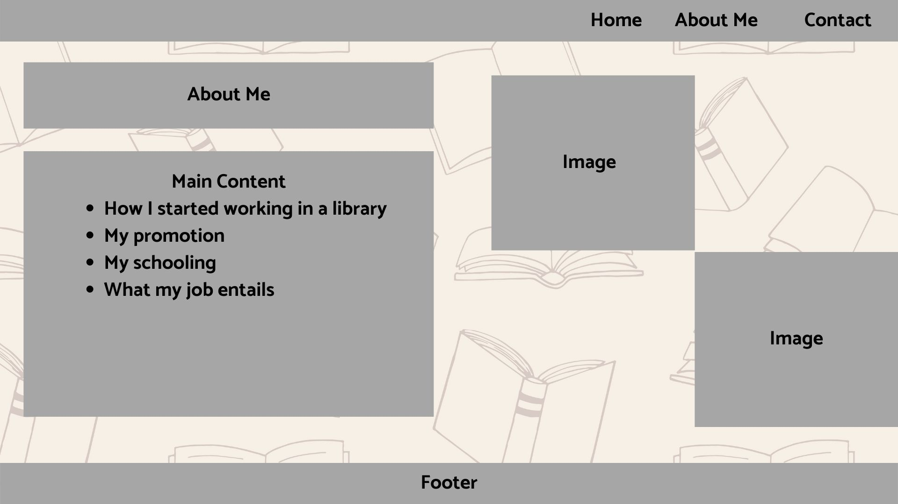
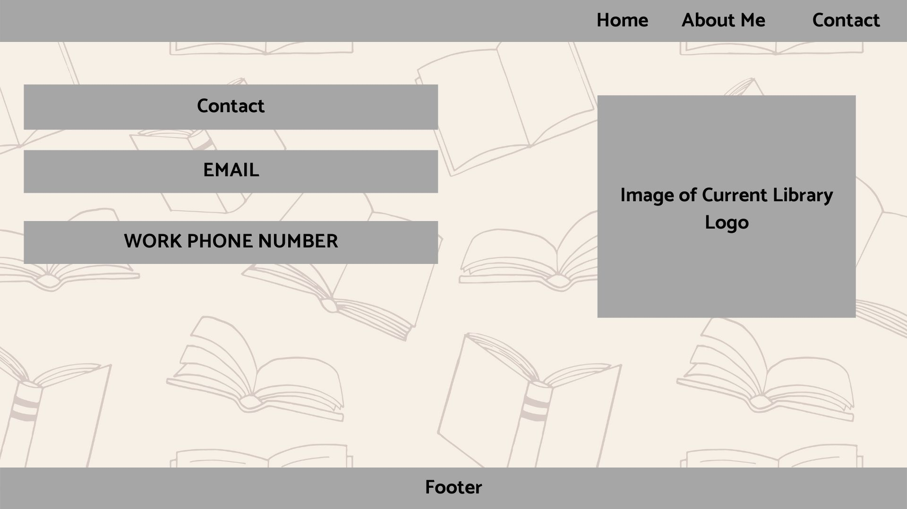

# Kim Poma's INF6420 Project

A portfolio site showcasing my work.

## Wireframes

Here is a digital wireframe to plan out how the website would look

Header - will include nagaivgation menu

Navigation Menu - will include links to other pages like about me and contact

Main Content - will give brief description about current job title

Footer - will include copyright information

Here is what the About Me page will look like

Header - will include navigation menu

Navigation Menu - will include links to other pages like home and contact

Main Content - will include my history of working in libraries, promotion, schooling and current job duties

Image - will include image of me

Image - will include image of me

Footer - will include copyright information

Here is what the Contact page will look like

Header - will include navigation menu

Navigation Menu - will include links to other pages like home and about me

Main Content - will include my work email and work phone number

Image - will include logo of current library occupation

Footer - will include copyright information